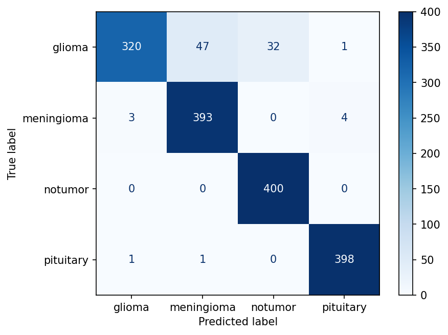
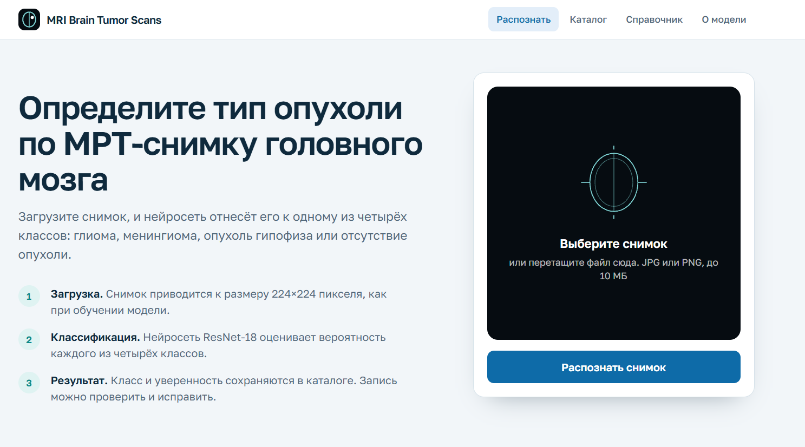
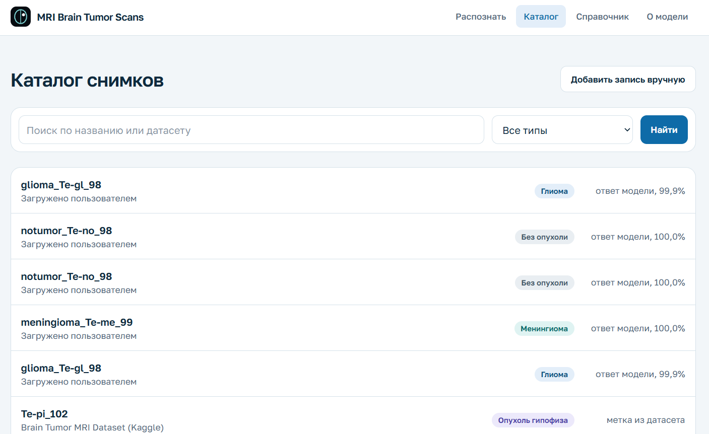
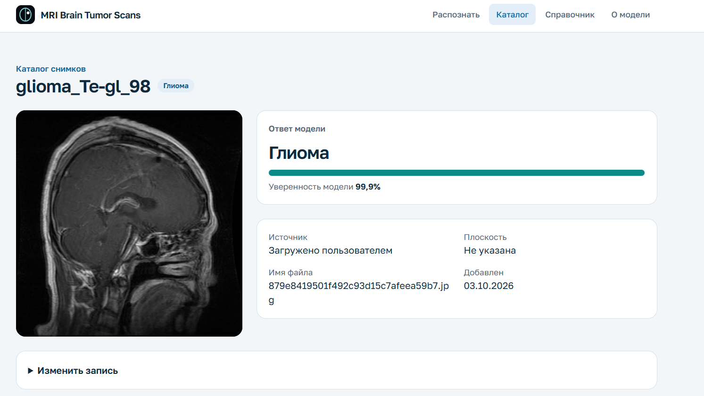
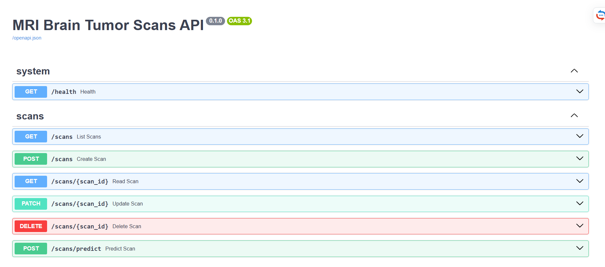

# MRI Brain Tumor Scans


Веб-приложение для ведения каталога МРТ-снимков головного мозга и автоматического распознавания типа опухоли. Пользователь приложения - исследователь, который готовит и анализирует данные для модели: он просматривает и ищет записи о снимках, добавляет новые и загружает изображения, по которым встроенная нейросеть определяет класс.

> Это исследовательский прототип. Результат распознавания не является медицинским диагнозом.

## Связь с темой диссертации

Тема диссертации: «Разработка системы распознавания опухолей головного мозга по МРТ-снимкам на основе глубокого обучения».

Приложение - демонстрационная часть исследования. Обученная модель классификации встроена в рабочую систему: снимок загружается через сайт, модель возвращает класс и уверенность, результат сохраняется в базе данных, и его можно сравнить с подтверждённой меткой.

## Возможности

- Список снимков с постраничным выводом, новые записи сверху.
- Поиск по названию и датасету, фильтр по типу опухоли.
- Карточка снимка с изображением и результатом распознавания.
- Добавление записи через форму с проверкой данных.
- Редактирование и удаление записи.
- Распознавание: загрузка файла JPG или PNG на главной странице, определение класса и уверенности модели.
- Справочник по четырём классам, которые различает модель.
- Страница «О модели»: параметры обучения, метрики по классам, матрица ошибок и ограничения.
- Документация API (OpenAPI) по адресу `/docs`.
- Обработка ошибок: 404 (запись не найдена), 409 (дубликат имени файла), 413 (файл больше 10 МБ), 422 (неверные данные или файл не является изображением).

## Стек технологий

| Слой | Технологии |
| --- | --- |
| Фронтенд | Next.js (App Router), React, TypeScript, Tailwind CSS, шрифт Golos Text |
| Бэкенд | Python 3.12, FastAPI, Pydantic, SQLAlchemy 2, Alembic |
| Модель | ResNet-18, обучение в PyTorch, инференс через ONNX Runtime |
| База данных | PostgreSQL 17 |
| Инфраструктура | Docker Compose, GitHub Actions, Dependabot |
| Качество кода | pytest, Ruff, ESLint |

## Запуск

Нужны Git и Docker.

```bash
git clone https://github.com/nurgul-zhumabayeva/mri-brain-tumor-system.git
cd mri-brain-tumor-system
cp .env.example .env
docker compose up --build
```

После запуска:

- сайт: http://localhost:3000
- документация API: http://localhost:8000/docs

Загрузка начальных данных (40 записей):

```bash
docker compose exec backend python -m scripts.seed
```

## Модель

| Параметр | Значение |
| --- | --- |
| Архитектура | ResNet-18, предобученная на ImageNet, дообучены все слои |
| Классы | глиома, менингиома, опухоль гипофиза, без опухоли |
| Вход | изображение 224×224, нормализация ImageNet |
| Обучение | 5 эпох, Adam, lr = 1e-4, размер батча 32 |
| Аугментация | горизонтальное отражение, поворот до 10° |
| Среда обучения | Google Colab, GPU T4 |
| Формат в приложении | ONNX, файл `backend/ml/brain_tumor_resnet18.onnx` |

Результаты на тестовой выборке (1600 снимков, по 400 на класс), точность (accuracy) 94,44%:

| Класс | Precision | Recall | F1 |
| --- | --- | --- | --- |
| Глиома | 0,9877 | 0,8000 | 0,8840 |
| Менингиома | 0,8912 | 0,9825 | 0,9346 |
| Без опухоли | 0,9259 | 1,0000 | 0,9615 |
| Опухоль гипофиза | 0,9876 | 0,9950 | 0,9913 |



### Ограничения

- Полнота для глиомы 80%: из 400 глиом 47 отнесены к менингиоме и 32 к классу «без опухоли». Пропуск опухоли - самая серьёзная ошибка для этой задачи, и это главное направление для улучшения модели.
- Модель всегда выбирает один из четырёх классов. Если загрузить изображение, которое не является МРТ головного мозга, она всё равно вернёт ответ, возможно с высокой уверенностью.
- Модель не определяет плоскость снимка, это поле заполняется вручную.
- Модель не дообучается на загруженных снимках. Чтобы её улучшить, нужно заново провести обучение и заменить файл модели.

## Данные

Использован открытый датасет [Brain Tumor MRI Dataset](https://www.kaggle.com/datasets/masoudnickparvar/brain-tumor-mri-dataset) (Kaggle). Персональных данных пациентов в проекте нет.

Начальные данные (`backend/data/scans.csv`) - это 40 записей: первые 5 файлов каждого класса из обучающей и тестовой выборок датасета. В репозитории хранятся только имена файлов и метки, сами изображения датасета не хранятся. Снимки, загруженные через сайт, сохраняются в томе Docker.

## API

| Метод | Адрес | Назначение |
| --- | --- | --- |
| GET | `/health` | Проверка работы сервера |
| GET | `/scans` | Список с параметрами `q`, `tumor_type`, `limit`, `offset` |
| GET | `/scans/{id}` | Одна запись |
| POST | `/scans` | Создание записи |
| POST | `/scans/predict` | Загрузка снимка и распознавание |
| PATCH | `/scans/{id}` | Изменение записи |
| DELETE | `/scans/{id}` | Удаление записи |
| GET | `/media/{name}` | Загруженное изображение |

## Тесты и проверки

```bash
cd backend
uv sync
uv run pytest -q
uv run ruff check .

cd ../frontend
npm ci
npm run lint
npm run build
```

В бэкенде 14 тестов: CRUD, поиск, фильтр, пагинация, распознавание и ошибки 404, 409, 422. При каждом pull request и отправке в `main` GitHub Actions запускает линтеры, тесты и сборку. Dependabot следит за обновлениями зависимостей.

## Структура проекта

```text
backend/
  app/
    core/config.py          настройки
    db.py                   подключение к базе данных
    main.py                 приложение FastAPI
    modules/
      scans/                модель, схемы, сервис, эндпоинты
      inference/            предобработка снимка и запуск модели
  alembic/                  миграции
  ml/                       файл модели и список классов
  data/, scripts/           начальные данные и скрипт загрузки
  tests/                    тесты
frontend/
  src/app/                  страницы и Server Actions
  src/components/           формы
  src/lib/                  клиент API и типы
docs/                       архитектура и скриншоты
docker-compose.yml
```

Подробнее: [docs/architecture.md](docs/architecture.md).

## Скриншоты

Главная страница с загрузкой снимка:



Каталог снимков с поиском и фильтром:



Карточка с результатом распознавания:



Документация API:



## Видео-демо

Ссылка: добавить после записи.

## AI assistance

При разработке использовался AI-ассистент Claude (Anthropic). С его помощью:

- код из методических указаний адаптирован под сущность «МРТ-снимок»: бэкенд, фронтенд, тесты, Docker, CI;
- написаны ноутбук обучения модели и модуль распознавания;
- найдена причина ошибки Frontend CI: правило `lib/` в шаблоне `.gitignore` для Python скрывало папку `frontend/src/lib`;
- подготовлен черновик документации.

Автор самостоятельно настроила окружение, выполнила и проверила все шаги, запускала тесты и ручные сценарии, обучила модель в Google Colab и проверила её работу на тестовых снимках и в приложении.

## Лицензия

MIT, см. файл [LICENSE](LICENSE).
