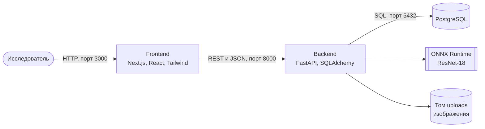
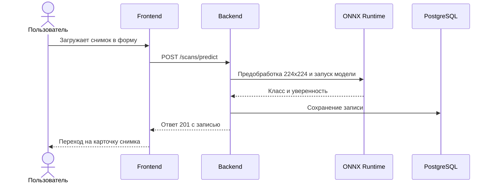
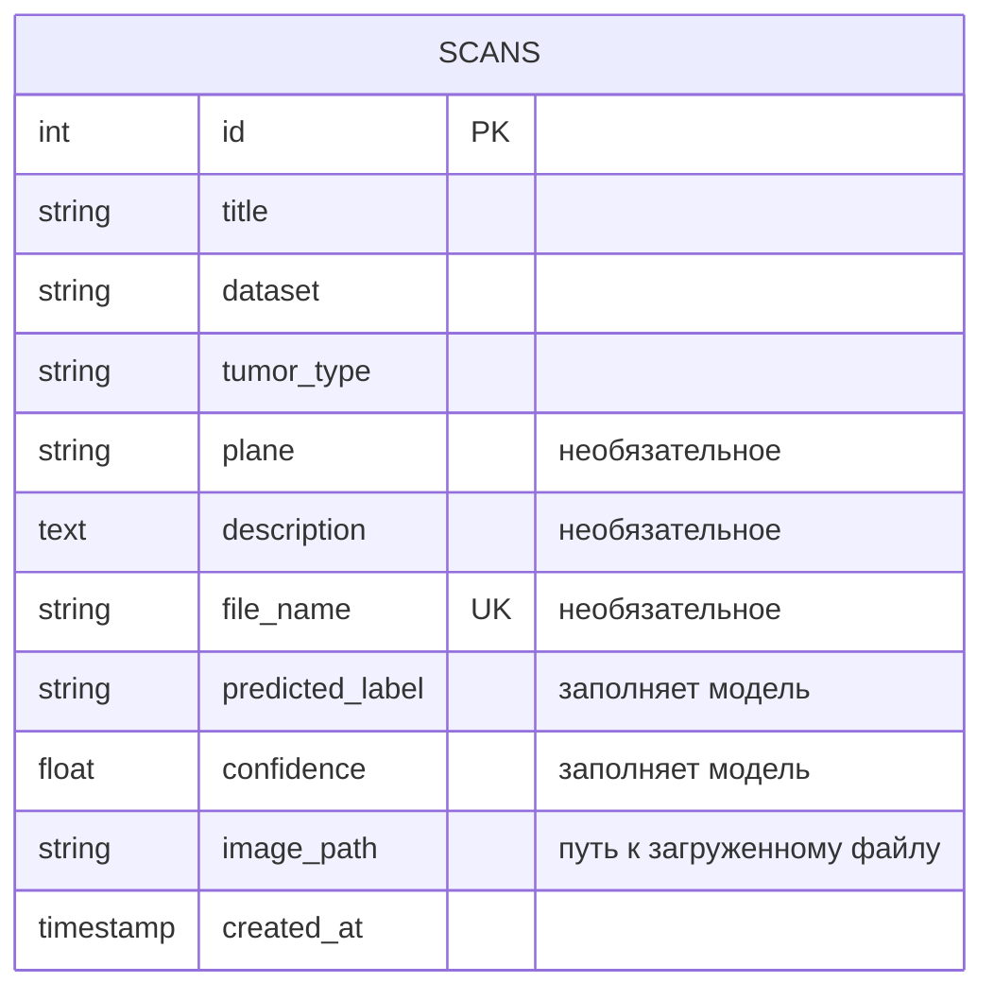

# Архитектура

## Обзор

Приложение построено как модульный монолит из трёх контейнеров: фронтенд, бэкенд и база данных. Все они запускаются одной командой через Docker Compose.

## Схема контейнеров

- **Frontend.** Отрисовывает страницы на сервере. Браузер не обращается к API напрямую: все запросы к бэкенду выполняют серверные компоненты и Server Actions.
- **Backend.** REST API, проверка данных, работа с базой и запуск модели.
- **PostgreSQL.** Хранит записи о снимках. Схема меняется только через миграции Alembic.
- **Том uploads.** Хранит загруженные изображения, чтобы они не пропадали при пересборке контейнера.

## Поток распознавания

## Модель данных

Поле `tumor_type` хранит подтверждённый тип опухоли, а `predicted_label` — ответ модели. При распознавании они совпадают. Если исследователь исправляет тип вручную, расхождение видно в карточке, и такие случаи можно разбирать как ошибки модели.

## Слои бэкенда

Каждый модуль в `app/modules` разделён на слои:

| Файл | Ответственность |
| --- | --- |
| `models.py` | Структура таблицы (SQLAlchemy) |
| `schemas.py` | Формат и проверка входных и выходных данных (Pydantic) |
| `service.py` | Бизнес-логика и запросы к базе |
| `router.py` | HTTP-эндпоинты и коды ответов |

Модуль `inference` не знает о базе данных и HTTP: он получает байты изображения и возвращает класс и уверенность. Поэтому модель можно заменить, не меняя остальной код.

## Архитектурные решения (ADR)

### ADR-1. Инференс через ONNX Runtime вместо PyTorch

**Контекст.** Модель обучена в PyTorch. Если ставить PyTorch в контейнер бэкенда, образ вырастает на несколько гигабайт, а сборка и CI замедляются.

**Решение.** После обучения модель экспортируется в формат ONNX. В приложении используется только ONNX Runtime на CPU.

**Последствия.** Образ остаётся небольшим, PyTorch нужен только при обучении. Предобработка изображения в приложении написана на NumPy и Pillow и должна точно повторять предобработку при обучении: размер 224×224 и нормализация ImageNet.

### ADR-2. Обращения к API только с сервера Next.js

**Контекст.** Формы можно отправлять из браузера напрямую в API, но тогда нужны настройка CORS, публичный адрес API и состояние на клиенте.

**Решение.** Данные читают серверные компоненты, а формы отправляются через Server Actions. Изображения браузер получает через маршрут фронтенда `/media/[name]`, который запрашивает файл у бэкенда.

**Последствия.** Адрес API задаётся одной переменной окружения `API_URL` и не попадает в браузер. Клиентского кода мало: только компоненты форм.

### ADR-3. Изображения на диске, в базе только путь

**Контекст.** Загруженные снимки нужно хранить и показывать в карточке.

**Решение.** Файл сохраняется в папку `uploads` под случайным именем, в базе хранится только это имя. Папка подключена как том Docker. При удалении записи файл тоже удаляется.

**Последствия.** База остаётся компактной. Случайные имена исключают конфликты и подмену путей. Для развёртывания на нескольких серверах том нужно будет заменить на объектное хранилище.

### ADR-4. Файл модели хранится в репозитории

**Контекст.** Проект должен запускаться одной командой без ручных шагов.

**Решение.** Файл модели (около 45 МБ) и список классов лежат в `backend/ml` и попадают в образ при сборке.

**Последствия.** Запуск воспроизводим, тесты в CI проверяют настоящую модель. Для моделей больше 100 МБ потребуется Git LFS или загрузка при сборке.
